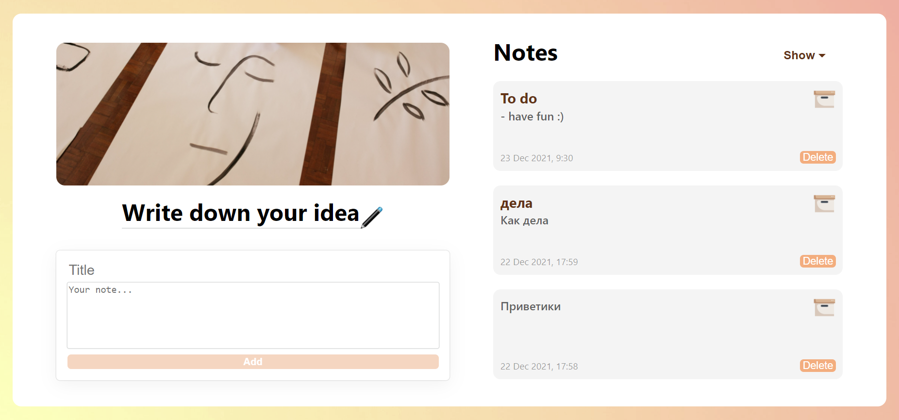

Deployed link: https://zealous-jepsen-4bb6d1.netlify.app

# Note App Project

A simple note application built with React.js

## Table of contents

- [Overview](#overview)
  - [The challenge](#the-challenge)
  - [Screenshot](#screenshot)
  - [Links](#links)
- [My process](#my-process)
  - [Built with](#built-with)
  - [What I learned](#what-i-learned)
- [Author](#author)
- [Acknowledgments](#acknowledgments)

## Overview

### The challenge

Users should be able to:

- View the desktop layout
- Create notes with title and content
- Be able to modify/delete/archivate notes

### Screenshot

### Links

- Live Site URL: [note-app](https://zealous-jepsen-4bb6d1.netlify.app)

## My process

### Built with

- Semantic HTML5 markup
- CSS custom properties
- Flexbox
- Vanilla JavaScript
- Local Storage mocking back-end

### What I learned
In this project I was learning to:
- use React.js
- save data in localStorage
- deploy apps

## Author

Github Profile - @AnyaJoy

## Acknowledgments

This project was a part of Front-end development course from ITC. They provided the idea and technical plan! It was fun making it! :)
